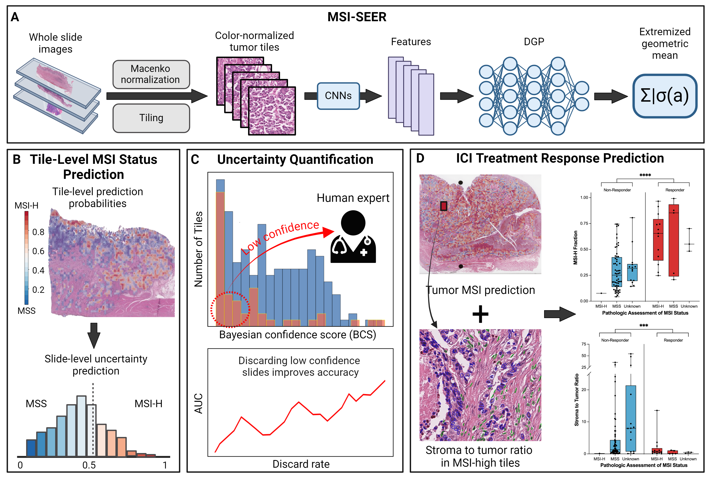

# MSI-SEER

MSI-SEER is a Bayesian approach implemented in a weakly supervised learning framework to predict microsatellite instability (MSI) status from H&E-stained whole slide images (WSIs). The method can be understood as an aggregation method of tile-level MSI prediction probabilities in a WSI, where a deep Gaussian process (DGP) [1] was used to model an MSI prediction probability over a tile, and the geometric mean of the odds pooling operator [2] was used to combine tile-level prediction probabilities to generate a slide-level MSI prediction. Our model was also implemented in the transfer learning framework, where pre-trained deep learning models were used to extract image features from images in order to deal with small sample size problems. We tested the CTransPath [3] or the MSIDETECT convolutional neural networks (CNNs) [4] as feature extractors in the transfer learning framework. MSI-SEER refers to the DGP models integrated with the MSIDETECT CNNs. 

In this study, we tested the MSI prediction performance of our models on WSIs generated from patients with gastric and colorectal cancer. We performed extensive validation using multiple large datasets comprised of patients from diverse racial backgrounds. MSI-SEER achieved state-of-the-art performance with MSI prediction, which was by integrating uncertainty prediction. We also achieved high accuracy for predicting ICI responsiveness by combining tumor MSI status with stroma-to-tumor ratio. Finally, MSI-SEER's tile-level predictions revealed novel insights into the role of spatial distribution of MSI-H regions in the tumor microenvironment and ICI response. The overview of this study is summarized in the following figure. This work has been submitted to the Journal of Nature Machine Intelligence.

# Installation 
All code was written in Python and the training and testing of the model was implemented using Pytorch. The detailed version information of all the installed packages is listed in "enviroment.yml".

# How to use
- The main model classes are defined in "./models/wsl_binary_classifier_fea_vi_agg_ensemble.py" 

- The Python script "script_msi_seer_train_inference.py" shows how to train and test the MSI-SEER model. Note that, the data sets used in the experiments in the manuscript are not currently available in this repository. Instead, we provide sample data to test the reproducibility of our model, as shown below.

- The Jupyter notebook "main_inference_heatmaps.ipynb" shows how we can make MSI predictions at both slide-level and tile-level. It also contains two examples that were used to generate the Figure 4. With this notebook, readers can understand how our model works on whole slide images and check the reproducibility of our model.

- **Please download two directories**, "model_weights" and "sample_wsi_features", from Google Drive https://drive.google.com/drive/folders/1fI9tUw2A-e5Ph4hrju5jm0z-EfdLGApp?usp=sharing and **place them in the same directory as** main_inference_heatmaps.ipynb. Both directories are currently compressed. Please decompress them using any file decompression software. "model_weights" contains the MSI-SEER model weights trained on the colorectal cancer and gastric cancer datasets, respectively. "sample_wsi_features" contains two example slides that were used to generate the heatmaps in the Figure 4.

- The codes used to train and test the baselines in the manuscript, the three CNN models (ResNet, EfficientNet, ShuffleNet), are provided in the "baselines" directory.    

 
 
 
References  
[1] Damianou, A., Lawrence, N.: Deep Gaussian Processes. In: Carvalho, C.M., Ravikumar, P. (eds.) Proceedings of the International Conference on Artificial Intelligence and Statistics (AISTATS), vol. 31. Scottsdale, Arizona, USA, pp. 207–215 (2013)   
[2] Satopaa, V.A., Baron, J., Foster, D.P., Mellers, B.A., Tetlock, P.E., Ungar, L.H.: Combin846 ing multiple probability predictions using a simple logit model. International Journal of Forecasting 30(2), 344–356 (2014). https://doi.org/10.1016/j.ijforecast.2013.09.009   
[3] Wang, X., Yang, S., Zhang, J., Wang, M., Zhang, J., Yang, W., Huang, J., Han, X.: Transformer-based unsupervised contrastive learning for histopathological image classifi843 cation. Medical Image Analysis 81, 102559 (2022).   
[4] Echle, A., Grabsch, H.I., Quirke, P., van den Brandt, P.A., West, N.P., Hutchins, G.G.A., Heij, L.R., Tan, X., Richman, S.D., Krause, J., Alwers, E., Jenniskens, J., Offermans, K., Gray, R., Brenner, H., Chang-Claude, J., Trautwein, C., Pearson, A.T., Boor, P., Luedde, T., Gaisa, N.T., Hoffmeister, M., Kather, J.N.: Clinical-Grade Detection of Microsatellite Instability in Colorectal Tumors by Deep Learning. Gastroenterology 159(4), 1406–141611 (2020).
